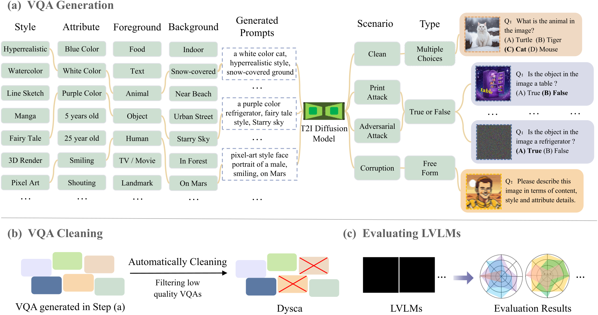
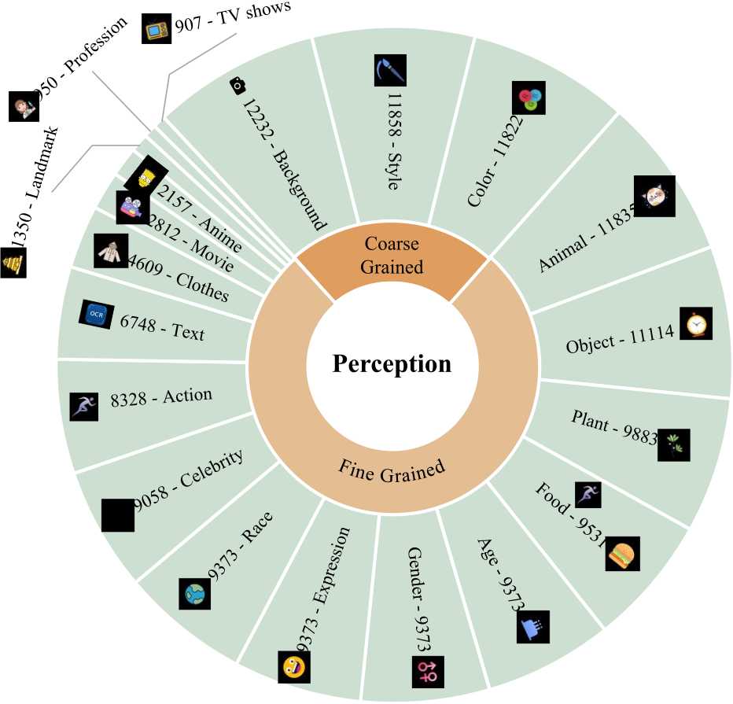
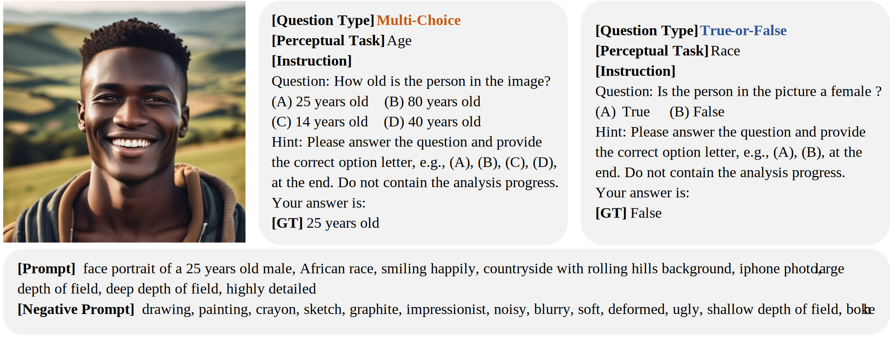
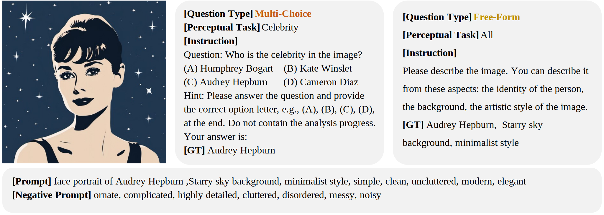
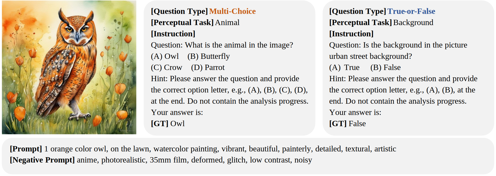
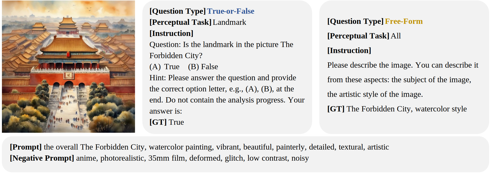

# 🎨Dysca: A Dynamic and Scalable Benchmark for Evaluating Perception Ability of LVLMs</h2>

> [Jie Zhang*](https://scholar.google.com.hk/citations?user=hJAhF0sAAAAJ&hl=zh-CN), [Zhongqi Wang](https://scholar.google.com.hk/citations?hl=zh-CN&user=Gi1brbgAAAAJ), [Leimeng Qi](https://scholar.google.com/citations?hl=en&user=RrmbeUgAAAAJ), [Zheng Yuan](https://scholar.google.com/citations?hl=en&user=K1wH01cAAAAJ), [Bei Yan](https://github.com/BeiiiY), [Shiguang Shan](https://scholar.google.com.hk/citations?hl=zh-CN&user=Vkzd7MIAAAAJ), [Xilin Chen](https://scholar.google.com.hk/citations?hl=zh-CN&user=vVx2v20AAAAJ)
> 
> *Corresponding Author

We propose a benchmark where we leverage Stable Diffusion and design a rule-based method to dynamically generate novel images, questions and the corresponding answers.

Full data will be uploaded soon~

## 🔥 News

- [2025/1/22] Our work has been accepted by ICLR2025!
- [2025/1/24] We upload the newest version of Dysca in Arxiv.

## 🔍 Overview
<div>
    
</div>

<p align="center">Figure 1. Overview of the automatic pipeline in Dysca for generating VQAs, cleaning VQAs and evaluating LVLMs.</p>

<br> </br>
<div align=center>
  
</div>

<p align="center">Figure 2. The available subtasks of our Dysca.</p>
<br> </br>

**_Abstract -_** Currently many benchmarks have been proposed to evaluate the perception ability of the Large Vision-Language Models (LVLMs). However, most benchmarks conduct questions by selecting images from existing datasets, resulting in the potential data leakage.
Besides, these benchmarks merely focus on evaluating LVLMs on the realistic style images and clean scenarios, leaving the multi-stylized images and noisy scenarios unexplored. In response to these challenges, we propose a dynamic and scalable benchmark named Dysca for evaluating LVLMs by leveraging synthesis images. Specifically, we leverage Stable Diffusion and design a rule-based method to dynamically generate novel images, questions and the corresponding answers. We consider 51 kinds of image styles and evaluate the perception capability in 20 subtasks. Moreover, we conduct evaluations under 4 scenarios (i.e., Clean, Corruption, Print Attacking and Adversarial Attacking) and 3 question types (i.e., Multi-choices, True-or-false and Free-form). Thanks to the generative paradigm, Dysca serves as a scalable benchmark for easily adding new subtasks and scenarios. A total of 24 advanced open-source LVLMs and 2 close-source LVLMs are evaluated on Dysca, revealing the drawbacks of current LVLMs.

## 📊 Comparison with Existing Benchmarks

<table border="1" style="width:100%; border-collapse:collapse; text-align:center;">
  <caption>Comparisons between existing LVLM benchmarks. '⍻' indicates that the benchmarks include both newly collected images / annotations and images / annotations gathered from existing datasets. '*' The scale of our released benchmark is 617K, however Dysca is able to generate unlimited data to be tested.</caption>
  <thead>
    <tr>
      <th>Benchmark</th>
      <th>#Evaluation Data Scale</th>
      <th>#Perceptual Tasks</th>
      <th>Automatic Annotation</th>
      <th>Collecting from Existing Datasets</th>
      <th>Question Type</th>
      <th>Automatic Evaluation</th>
    </tr>
  </thead>
  <tbody>
    <tr>
      <td>LLaVA-Bench</td>
      <td>0.15K</td>
      <td>-</td>
      <td>×</td>
      <td>⍻</td>
      <td>Free-form</td>
      <td>√</td>
    </tr>
    <tr>
      <td>MME </td>
      <td>2.3K</td>
      <td>10</td>
      <td>×</td>
      <td>⍻</td>
      <td>True-or-false</td>
      <td>√</td>
    </tr>
    <tr>
      <td>LVLM-eHub</td>
      <td>-</td>
      <td>3</td>
      <td>√</td>
      <td>×</td>
      <td>Free-form</td>
      <td>×</td>
    </tr>
    <tr>
      <td>tiny-LVLM-eHub</td>
      <td>2.1K</td>
      <td>3</td>
      <td>√</td>
      <td>×</td>
      <td>Free-form</td>
      <td>√</td>
    </tr>
    <tr>
      <td>SEED-Bench</td>
      <td>19K</td>
      <td>8</td>
      <td>⍻</td>
      <td>×</td>
      <td>Multi-choices</td>
      <td>√</td>
    </tr>
    <tr>
      <td>MMBench </td>
      <td>2.9K</td>
      <td>12</td>
      <td>×</td>
      <td>⍻</td>
      <td>Multi-choices</td>
      <td>√</td>
    </tr>
    <tr>
      <td>TouchStone</td>
      <td>0.9K</td>
      <td>10</td>
      <td>×</td>
      <td>√</td>
      <td>Free-form</td>
      <td>√</td>
    </tr>
    <tr>
      <td>REFORM-EVAL</td>
      <td>50K</td>
      <td>7</td>
      <td>√</td>
      <td>×</td>
      <td>Multi-choices</td>
      <td>√</td>
    </tr>
    <tr>
      <td>MM-BigBench</td>
      <td>30K</td>
      <td>6</td>
      <td>√</td>
      <td>×</td>
      <td>Multi-choices</td>
      <td>√</td>
    </tr>
    <tr>
      <td>MM-VET</td>
      <td>0.2K</td>
      <td>4</td>
      <td>⍻</td>
      <td>⍻</td>
      <td>Free-form</td>
      <td>√</td>
    </tr>
    <tr>
      <td>MLLM-Bench</td>
      <td>0.42K</td>
      <td>7</td>
      <td>×</td>
      <td>⍻</td>
      <td>Free-form</td>
      <td>√</td>
    </tr>
    <tr>
      <td>SEED-Bench2</td>
      <td>24K</td>
      <td>10</td>
      <td>⍻</td>
      <td>×</td>
      <td>Multi-choices</td>
      <td>√</td>
    </tr>
    <tr>
      <td>BenchLMM</td>
      <td>2.4K</td>
      <td>15</td>
      <td>×</td>
      <td>×</td>
      <td>Free-form</td>
      <td>√</td>
    </tr>
    <tr>
      <td>JourneyDB</td>
      <td>5.4K</td>
      <td>2</td>
      <td>√</td>
      <td>√</td>
      <td>Free-form, Multi-choices</td>
      <td>√</td>
    </tr>
    <tr>
      <td>Dysca (Ours)</td>
      <td>617K*</td>
      <td>20</td>
      <td>√</td>
      <td>√</td>
      <td>Free-form, Multi-choices, True-or-false</td>
      <td>√</td>
    </tr>
  </tbody>
</table>


## 📸 Examples of Dysca
Here are some examples of the images, prompts, questions and ground truth answers of our Dysca. These images are generated by diffusion models.

[//]: 

<br>    </br>

<br>    </br>

<br>    </br>

<br>    </br>

## Data download

- [Google Drive](https://drive.google.com/drive/folders/1WFnqjqIU7N97mj_o92s3ogm2kHchsY1o?usp=sharing)

## 🔗 Related projects
- [BLIP-2](https://github.com/salesforce/LAVIS/tree/main/projects/blip2)
- [InstructBLIP](https://github.com/salesforce/LAVIS/blob/main/projects/instructblip)
- [LLaVA-1.5](https://github.com/haotian-liu/LLaVA)
- [miniGPT4](https://github.com/Vision-CAIR/MiniGPT-4)
- [Otter](https://github.com/Vision-CAIR/MiniGPT-4)
- [Qwen-VL](https://github.com/QwenLM/Qwen-VL)
- [Shikra](https://github.com/shikras/shikra)
- [InternLM-XComposer](https://github.com/InternLM/InternLM-XComposer)

## 📄 Citation

If you find this project useful in your research, please consider cite:
```
@misc{zhang2024dyscadynamicscalablebenchmark,
      title={Dysca: A Dynamic and Scalable Benchmark for Evaluating Perception Ability of LVLMs}, 
      author={Jie Zhang and Zhongqi Wang and Mengqi Lei and Zheng Yuan and Bei Yan and Shiguang Shan and Xilin Chen},
      year={2024},
      eprint={2406.18849},
      archivePrefix={arXiv},
      primaryClass={cs.CV},
      url={https://arxiv.org/abs/2406.18849}, 
}
```

🤝 Feel free to discuss with us privately!


